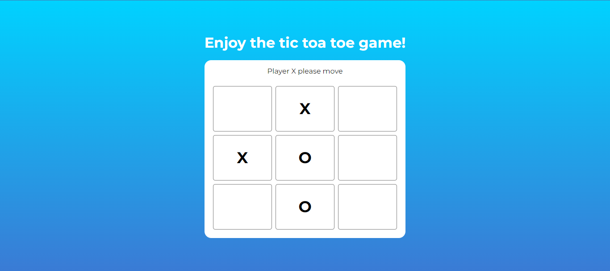

# Tic Tac Toe Game

Welcome to the Tic Tac Toe game built using React Hooks and TypeScript! This classic game is now available for you to enjoy right in your web browser.

## Demo
Check out the live demo of the game [here](https://vercel.com/sids-projects-5e95baf3/tic-tac-toe/8F7VEAHLjGLHggiSByVfA51K8kZX).

## Technologies Used
This game was built using React.js with functional components and hooks, and TypeScript for type safety.

## Running the Game Locally
To run the game locally on your machine, follow these steps:

1.Clone this repository to your local machine.

2.Navigate to the project directory.

3.Install dependencies by running npm install.

4.Start the development server with npm start

5.Open your browser and navigate to http://localhost:3000.

## Contributing

Contributions are welcome! If you find any bugs or have suggestions for improvements, feel free to open an issue or submit a pull request.

